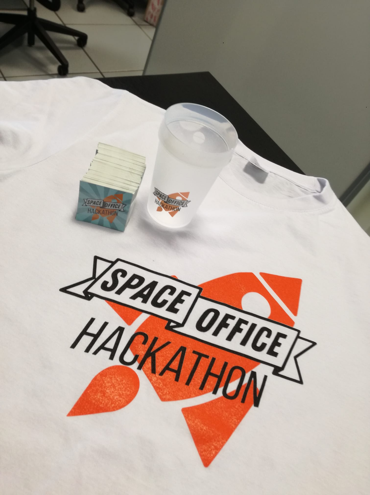
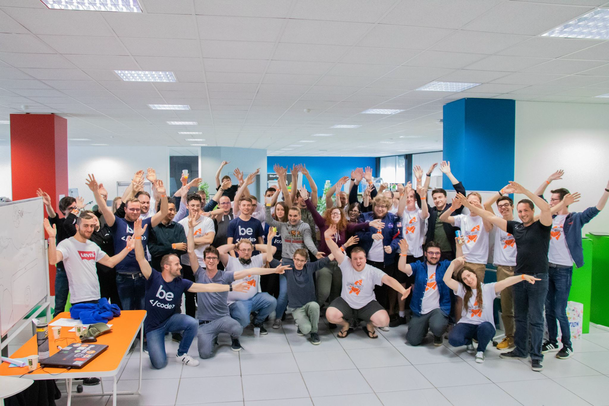
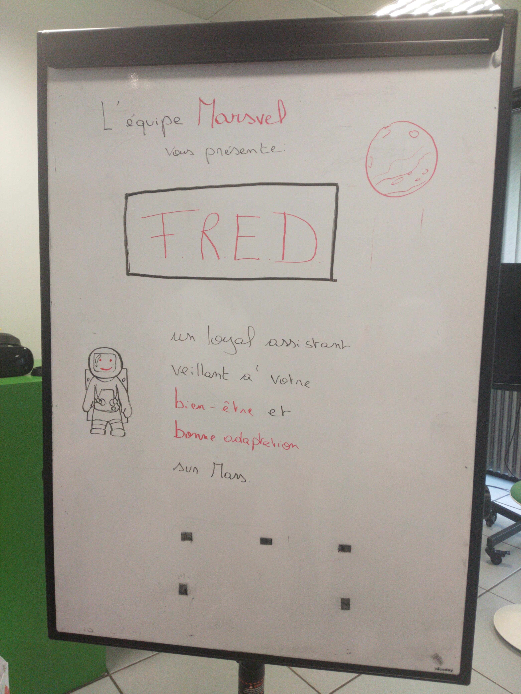
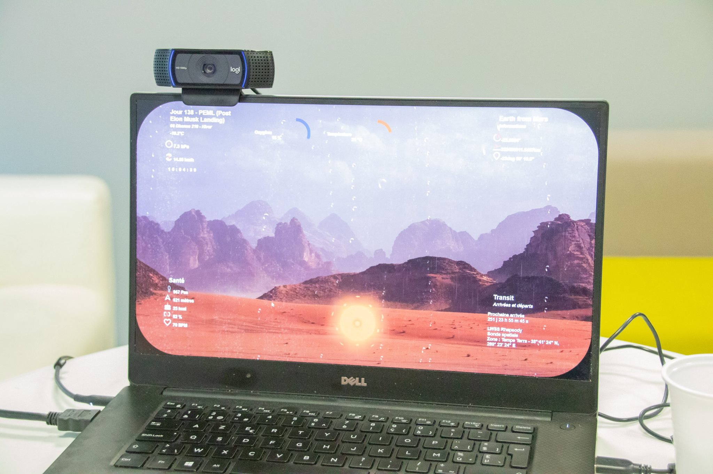
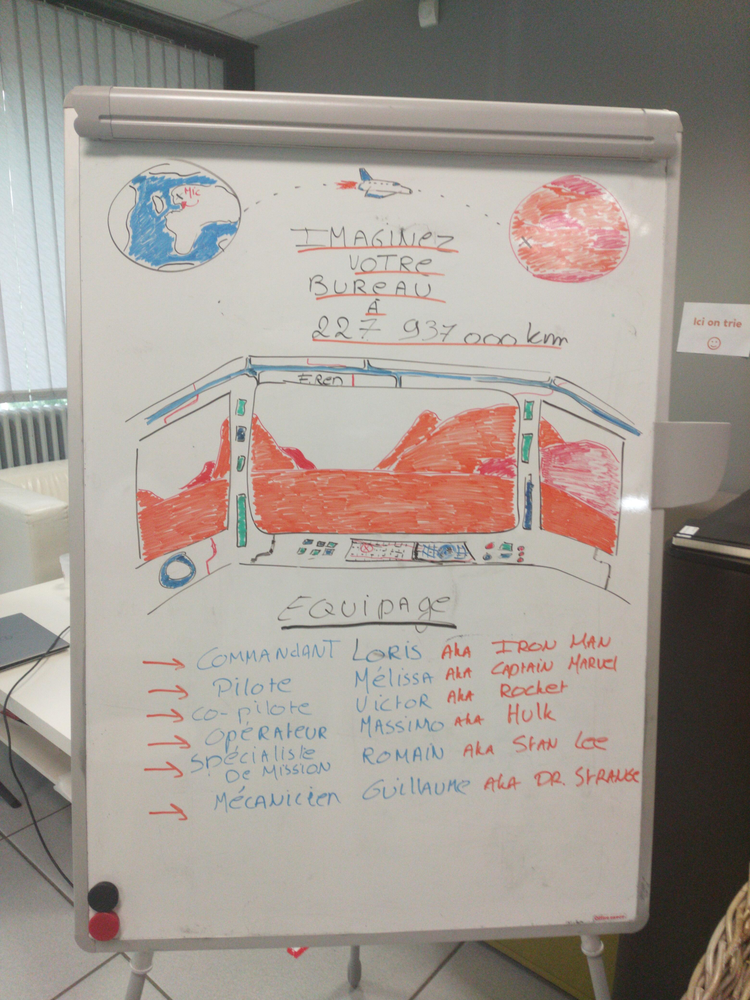
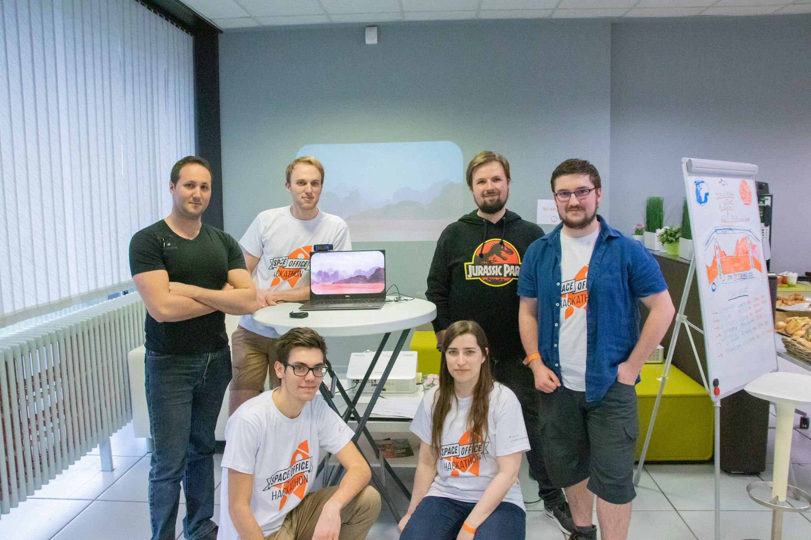
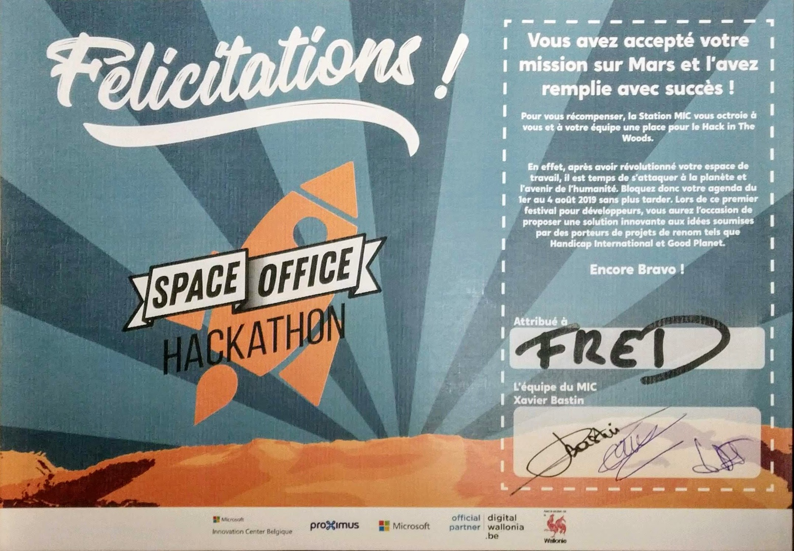
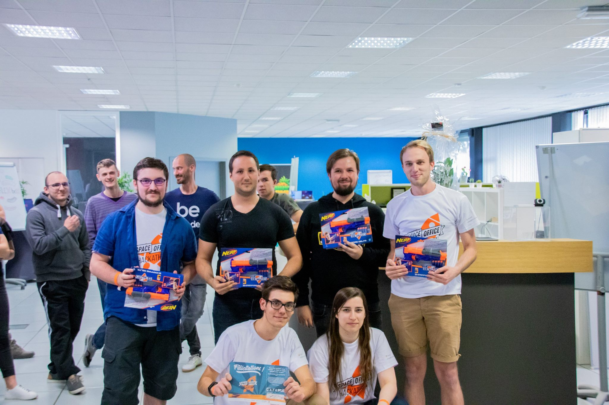

# Menu

* [MARS Hackaton](#mars-hackaton)
* [Project F.R.E.D.](#f.r.e.d.)
	- [Friendly remote environnement desktop](#friendly-remote-environnement-desktop)
	- [Smart Widgets](#smart-widgets)
* [Team](#team)
	- [Mars-Vel Assemble](#mars-vel-assemble)
	- [Developpers](#developpers)
    - [Graphic designer](#graphic-designer)
* [Mission Report](#mission-report)
    - [Successful landing for F.R.E.D.][#successful-landing-for-f.r.e.d.]
* [License](#license)
* [Technologies](#technologies)

# MARS Hackaton

This project was developped during the Microsoft Innovation Center's Hackaton (Space Office).
The timebox for this hackaton was a weekend (26/04/19 > 28/04/19).
The mission was to 'Improve life in the office on MARS'.

# F.R.E.D.

## Friendly remote environnement desktop

We are introducing F.R.E.D, it's a smart assistant aiming to improve daily life on MARS.
F.R.E.D. will be deployed on smart windows in the near future.
You just have to get closer to the window to trigger the assistant.
All employees will have smart wristband containing their personal informations.
F.R.E.D. retrieves and displays these informations in a friendly desktop environnement using widgets.
You are able to interact with it remotely using your voice.
F.R.E.D. is able to change the window background, display/hide smart widgets,help you relax when you are stressed, play music, give you the news, tell random facts and warnings about MARS. 
(F.R.E.D. supports only French at the moment)

### Smart Widgets

- ChillMusicVideo
- Earth
- Environnement
- F.R.E.D.
- Health
- Office
- Relax&Breathe
- Transit

# Team

The team behind this idea is Mars-Vel.

## Mars-Vel Assemble

### Developpers
- Melissa Fontesse
- Massimo Gentile
- Victor Pastorani
- Guillaume Rigaux
- Loris Rossi

### Graphic designer
- Romain Blondeau

# Mission Report

### Successful landing for F.R.E.D.

We got the audience award for this innovative concept. Thank you everyone for believing in us.

# License

We hope to see this project evolving into something bigger, join us, we want you aboard, we need all the help we can get.
Be ready for MARS !

### GNU GPL

# Technologies

### Front end: Angular

- Face api (tensorflowJS)
- Mi band 2 js (health data)
- Cognitive services Microsoft (LUIS)
- Google services (Text to speech, Speech to text)

### Back end:  Python

- Flask (web api)
